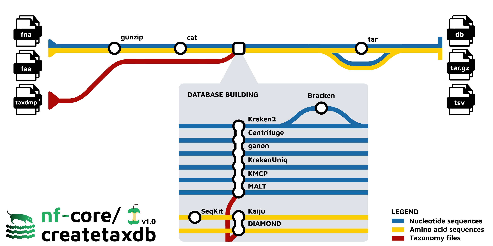

<h1>
  <picture>
    <source media="(prefers-color-scheme: dark)" srcset="docs/images/nf-core-createtaxdb_logo_dark_tax.png">
    
  </picture>
</h1>

[](https://github.com/nf-core/createtaxdb/actions/workflows/ci.yml)
[](https://github.com/nf-core/createtaxdb/actions/workflows/linting.yml)[](https://nf-co.re/createtaxdb/results)[](https://doi.org/10.5281/zenodo.15696114)
[](https://www.nf-test.com)

[](https://www.nextflow.io/)
[](https://github.com/nf-core/tools/releases/tag/3.3.1)
[](https://docs.conda.io/en/latest/)
[](https://www.docker.com/)
[](https://sylabs.io/docs/)
[](https://cloud.seqera.io/launch?pipeline=https://github.com/nf-core/createtaxdb)

[](https://nfcore.slack.com/channels/createtaxdb)[](https://bsky.app/profile/nf-co.re)[](https://mstdn.science/@nf_core)[](https://www.youtube.com/c/nf-core)

## Introduction

**nf-core/createtaxdb** is a bioinformatics pipeline that constructs custom metagenomic classifier databases for multiple classifiers and profilers from the same input reference genome set in a highly automated and parallelised manner.
It supports both nucleotide and protein based classifiers and profilers.
The pipeline is designed to be a companion pipeline to [nf-core/taxprofiler](https://nf-co.re/taxprofiler/) for taxonomic profiling of metagenomic data, but can be used for any context.

<h1>
  <picture>
    <source media="(prefers-color-scheme: dark)" srcset="assets/createtaxdb-metromap-diagram-dark.png">
    
  </picture>
</h1>

1. Prepares input FASTA files for building
2. Builds databases for:
   - [Bracken](https://doi.org/10.7717/peerj-cs.104)
   - [Centrifuge](https://doi.org/10.1101/gr.210641.116)
   - [DIAMOND](https://doi.org/10.1038/nmeth.3176)
   - [ganon](https://doi.org/10.1093/bioinformatics/btaa458)
   - [Kaiju](https://doi.org/10.1038/ncomms11257)
   - [KMCP](https://doi.org/10.1093/bioinformatics/btac845)
   - [Kraken2](https://doi.org/10.1186/s13059-019-1891-0)
   - [KrakenUniq](https://doi.org/10.1186/s13059-018-1568-0)
   - [MALT](https://doi.org/10.1038/s41559-017-0446-6)

## Usage

> [!NOTE]
> If you are new to Nextflow and nf-core, please refer to [this page](https://nf-co.re/docs/usage/installation) on how to set-up Nextflow. Make sure to [test your setup](https://nf-co.re/docs/usage/introduction#how-to-run-a-pipeline) with `-profile test` before running the workflow on actual data.

First, prepare an input CSV table with your input reference genomes that looks as follows:

```csv
id,taxid,fasta_dna,fasta_aa
Human_Mitochondrial_genome,9606,chrMT.fna,
SARS-CoV-2_genome,694009,GCA_011545545.1_ASM1154554v1_genomic.fna.gz,GCA_011545545.1_ASM1154554v1_genomic.faa.gz
Bacteroides_fragilis_genome,817,GCF_016889925.1_ASM1688992v1_genomic.fna.gz,GCF_016889925.1_ASM1688992v1_genomic.faa.gz
Candidatus_portiera_aleyrodidarum_genome,91844,GCF_000292685.1_ASM29268v1_genomic.fna,GCF_000292685.1_ASM29268v1_genomic.faa
Haemophilus_influenzae_genome,727,GCF_900478275.1_34211_D02_genomic.fna,GCF_900478275.1_34211_D02_genomic.faa
Streptococcus_agalactiae_genome,1311,,GCF_002881355.1_ASM288135v1_genomic.faa
```

Each row contains a human readable name, the taxonomic ID of the organism, and then an (optionally gzipped) Nucleotide and/or Amino Acid FASTA file.

Now, with an appropriate set of taxonomy files you can build databases for multiple profilers - such as Kraken2, ganon, and DIAMOND - in parallel:

```bash
nextflow run nf-core/createtaxdb \
   -profile <docker/singularity/.../institute> \
   --input samplesheet.csv \
   --accession2taxid /<path>/<to>/taxonomy/nucl_gb.accession2taxid \
   --nucl2taxid /<path>/<to>/taxonomy/nucl.accession2taxid.gz \
   --prot2taxid /<path>/<to>/taxonomy/prot.accession2taxid.gz \
   --nodesdmp /<path>/<to>/taxonomy/nodes.dmp \
   --namesdmp /<path>/<to>/taxonomy/names.dmp \
   --build_kraken2 \
   --kraken2_build_options='--kmer-len 45' \
   --build_ganon \
   --ganon_build_options='--kmer-size 45' \
   --build_diamond \
   --diamond_build_options='--no-parse-seqids' \
   --outdir <OUTDIR>
```

The output directory will contain directories containing the database files for each of the profilers you selected to build.
Optionally you can also package these as `tar.gz` archives.

You can also generate pre-prepared input sheets for database specifications of pipelines such as [nf-core/taxprofiler](https://nf-co.re/taxprofiler) using `--generate_downstream_samplesheets`.

> [!WARNING]
> Please provide pipeline parameters via the CLI or Nextflow `-params-file` option. Custom config files including those provided by the `-c` Nextflow option can be used to provide any configuration _**except for parameters**_; see [docs](https://nf-co.re/docs/usage/getting_started/configuration#custom-configuration-files).

For more details and further functionality, please refer to the [usage documentation](https://nf-co.re/createtaxdb/usage) and the [parameter documentation](https://nf-co.re/createtaxdb/parameters).

## Pipeline output

To see the results of an example test run with a full size dataset refer to the [results](https://nf-co.re/createtaxdb/results) tab on the nf-core website pipeline page.
For more details about the output files and reports, please refer to the
[output documentation](https://nf-co.re/createtaxdb/output).

## Credits

nf-core/createtaxdb was originally written by James A. Fellows Yates, Sam Wilkinson, Alexander Ramos Díaz, Lili Andersson-Li and the nf-core community.

We thank the following people for their extensive assistance in the development of this pipeline:

- Zandra Fagernäs for logo design

## Contributions and Support

If you would like to contribute to this pipeline, please see the [contributing guidelines](.github/CONTRIBUTING.md).

For further information or help, don't hesitate to get in touch on the [Slack `#createtaxdb` channel](https://nfcore.slack.com/channels/createtaxdb) (you can join with [this invite](https://nf-co.re/join/slack)).

## Citations

If you use nf-core/createtaxdb for your analysis, please cite it using the following doi: [10.5281/zenodo.15696114](https://doi.org/10.5281/zenodo.15696114)

An extensive list of references for the tools used by the pipeline can be found in the [`CITATIONS.md`](CITATIONS.md) file.

You can cite the `nf-core` publication as follows:

> **The nf-core framework for community-curated bioinformatics pipelines.**
>
> Philip Ewels, Alexander Peltzer, Sven Fillinger, Harshil Patel, Johannes Alneberg, Andreas Wilm, Maxime Ulysse Garcia, Paolo Di Tommaso & Sven Nahnsen.
>
> _Nat Biotechnol._ 2020 Feb 13. doi: [10.1038/s41587-020-0439-x](https://dx.doi.org/10.1038/s41587-020-0439-x).
